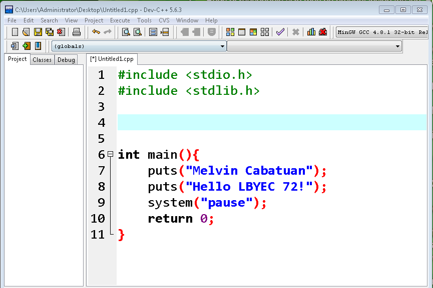

# LBYEC72-Practice

## First-time Push process

1. Open git bash command line tool.
2. Change to the directory of your project. Ex. ``` cd Documents/LBYEC72-SECTION/Practice ``` 
3. Initialize the repository with ``` git init ```.
4. Add files with ``` git add --all```.
5. Commit the changes with ``` git commit -m "added <describe-your-changes>"```.
6. Copy & paste the origin from the created repository in the github website: Ex. ```  git remote add origin master https://github.com/<username>/<your-repository-name>.git ```
7. Push your changes ``` git push -u origin master ```
8. Congratulations! You can now refresh your repository and see the changes.


## Modification-Push process

1. Add the modified files with ``` git add --all```.
2. Commit the changes with ``` git commit -m "added <describe-your-changes>"```.
3. Push your changes ``` git push -u origin master ```
4. Congratulations! You can now refresh your repository and see the changes.


```c
#include <stdio.h>
#include <stdlib.h>

int main(){
	puts("Melvin Cabatuan");
	puts("Hello LBYEC72!");
	system("pause");
	return 0;
}
```


